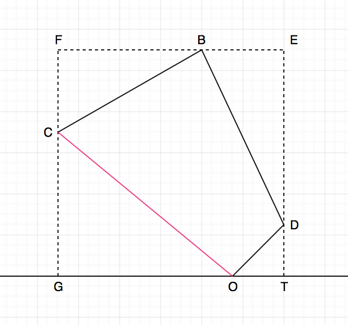

## Detail
[The Walker](https://www.codewars.com/kata/the-walker/train/rust)


The walker

The walker starts from point O, walks along OA, AB and BC. When he is in C (C will be in the upper half-plane), what is the distance `CO`? What is the angle `tOC` in positive degrees, minutes, seconds?

Angle `tOA` is `alpha` (here 45 degrees), angle `hAB` is `beta` (here 30 degrees), angle `uBC` is `gamma`(here 60 degrees).

\# Task
`function solve(a, b, c, alpha, beta, gamma)` with parameters

- a, b, c: positive integers in units of distance (stand for OA, AB, BC)
- alpha, beta, gamma: positive integers in degrees (positive angles are anticlockwise)


returns an array
- first element: distance CO (rounded to the nearest integer)
- then angle tOC with the third following elements:
 - second element of the array: number of degrees in angle tOC (truncated positive integer) 
 - third element of the array: number of minutes in angle tOC (truncated positive integer)
 - fourth element of the array: number of seconds in angle tOC (truncated positive integer)

\# Example:
```
print(solve(12, 20, 18, 45, 30, 60)) -> [15, 135, 49, 18]
- CO is 14.661... rounded to 15
- angle tOC is 135.821...
so
- degrees = 135
- minutes = 49.308...
- seconds = 18.518...

hence [15, 135, 49, 18]
```

\# Note
If you need the constant `pi` you can use `pi = 3.14159265358979323846`

## Thinking

 